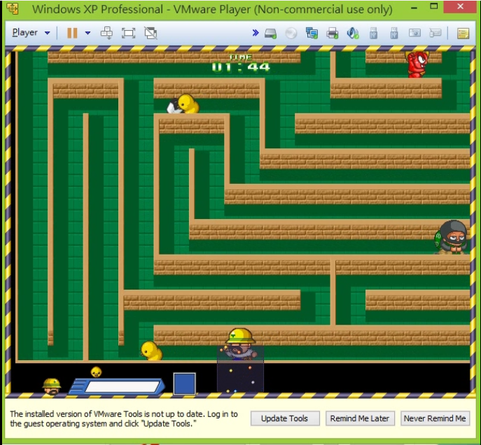

# 2015 年作品

---

#### \(6月\) ＯＯＰ期末專案 小雞與獵人遊戲仿製

要仿製的遊戲

.

要仿製的遊戲遊玩影片

這學期做好的遊戲遊玩影片

---

#### \(7月\)黑客松 - 夠過網路做遠端ＩＯ控制

可以透過網路遠端改變Arduino上面的GPIO的屬性

例如讓某個腳位變成讀取電壓大小

或是讓它輸出電壓

可以在不用改變Arduion 內部程式的情況下就做到這些事情

.

那時候沒有GihHub的概念所以東西不知道藏在電腦的哪裡，需要一點時間找找...

.

---

#### \(9月\)Osu! Plugin

[http://blog.udn.com/andy840119/29220447](http://blog.udn.com/andy840119/29220447)

節奏遊戲用的硬體外掛

在某些情況下可以加速得分

.

---

#### \(10月\) 黑客松 - 人物可以在螢幕前面跑呀跑

使用kinect 和

.

---

#### \(11月\) 黑客松 - ＮＦＣ智慧插頭

Android + Arduino

去年在黑客松的作品是智慧節電裝置

那時候打算做的內容主要是跟節電有關

大概先分析市場和其他需求發現

雖然說對於節電可以降低電費雖然是一個誘因

但誘因大到不會讓人有足夠的動力主動去節電

市面上也有一些節電裝置

但因為普遍單價太高，還有能夠控制的裝置太少

如果以金錢來考量，可能要好幾年才能回本，甚至根本回不了本，不太划算 .

加上有時候不太人性化，不太方便設定

就變得乏人問津 .

所以對於這個IDEA功能上重新作一些修改和新增

可以一次同時控制好幾個電器

並且各別設定開關時間 還有另外增加計時功能

例如像DVD撥放器大概一年才會用到幾次的

可以在使用時設定開啟3個小時\(一場影片大約兩個小時\)

之後就一值保持關閉的狀態，以減少待機時電源的浪費 .

還有操作的方式是手機透過NFC傳送設定到機器上

可以減少節電裝置上面元件，例如液晶面板

進而讓節電裝置本身耗電量更少 .

那時候除了做產品分析和規畫外，還有負責撰寫Android手機端 APP部分 .

最後這個作品在黑客松得到最佳技術獎 .

---

