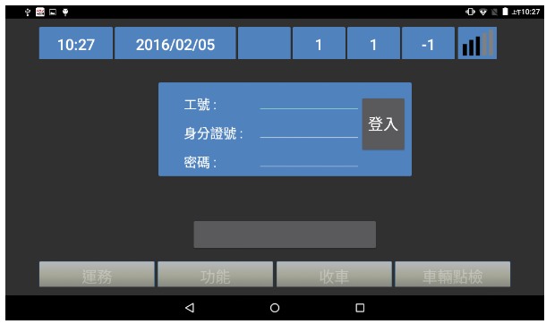
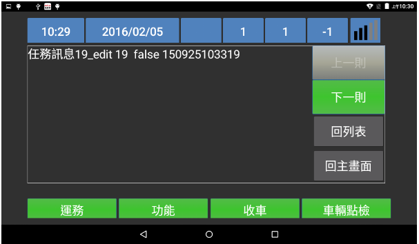
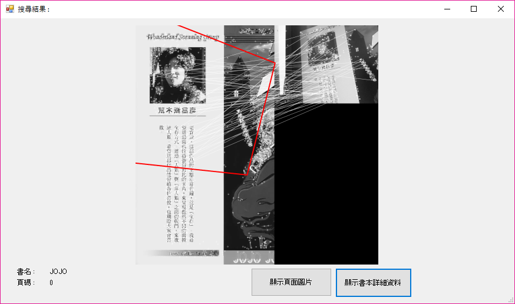

# 2016 年作品

---

#### \(1月\)Android 車機程式客戶端

之前在宇楊實習的時候在那邊幫忙寫了簡單的客戶端程式

在Android平板要連接一個RS232裝置 （我只有負責到這邊

RS232裝置則是連接到一個可以上網的小盒子

.

如果之後有RS232有收到小盒子傳送過來的通知訊息

就要顯示到畫面上，讓車上的人員可以做點和回報

點選好的結果除了存在本地端外，也會包成json格式回傳回去

.

在實習中學會了寫基礎的Android應用程式

修改第三方套件範本(Android 對 RS232裝置連線那邊)

和拉一些基礎的Layout

---

#### \(6月\)ComicSearcher

使用影像搜尋漫畫

用到EmguCV

可以透過攝影機拍到的東西抓取特徵點

然後從資料庫把預先掃描好建檔好的參數抓出來做比對

.

因為目前是從第一個參數開始一個一個比對的方式，效率還不高

以後如果有時間再去修正吧 &lt;&lt; 不過估計很快就忘記了 (汗

.

GitHub :

[https://github.com/andy840119/ComicSearcher/](https://github.com/andy840119/ComicSearcher/)

.

---

#### \(12月\) 下雪外掛

在Visual Studio IDE 上面做出下雪特效

希望工程師們在聖誕節那天，情侶都在外面約會時

也能在公司快樂工作

.

順帶一提，打字速度越快下的雪越多

.

Github連結 :

[https://github.com/andy840119/VisualStudioSnowEffect](https://github.com/andy840119/VisualStudioSnowEffect)

.

---

