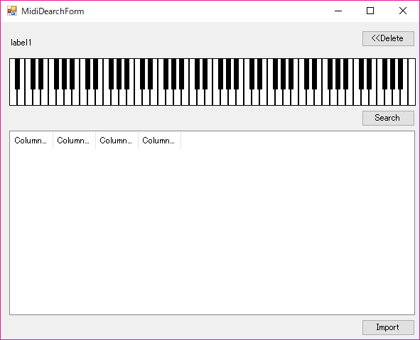

# 2017 年作品

---

#### \(2月\) osu!RP音樂模式製作開始\(開發中

在osu\(一款目前是開源的音樂遊戲\)框架上面開發新的音樂遊戲模式

四月目前因為要準備日文所以暫停開發

七月後要找人一起繼續做，估計年底完成

.

Youtube 開發日誌 :

[https://www.youtube.com/playlist?list=PLpScIlrOtEIWkjZywNxpFcFxRotiHzMoX](https://www.youtube.com/playlist?list=PLpScIlrOtEIWkjZywNxpFcFxRotiHzMoX)

.

GitHub :

[https://github.com/osu-RP/osu-RP](https://github.com/osu-RP/osu-RP)

.

算是第一次開發比較大型的專案

OpenSource框架程式碼應該超過5萬行以上，寫得算是蠻優良的，學到的很多以前不會用到的技巧

---

#### \(6月\)琴譜搜尋引擎\(未完成

這學期用寫了琴譜搜尋引擎

用NAudio先把 .mid\(可以視為音樂檔，或是一種琴譜格式檔案\)讀取資料

轉換成可以被搜尋的格式\(Document\)後

透過lucene這個搜尋引擎去建立索引和搜尋出來

.

理想效果只要彈出整首歌曲的任意幾個音符，就可以搜尋出對應的琴譜

目前是打算用asp.net製作，但網頁技能不強所以先暫時轉回windows form

專案如果想到還是會把它完成（目前也沒找到有其他搜尋引擎平台在做這個

不過估計得拖到2018年後了

.

GitHub :

[https://github.com/andy840119/MidiSearchEngine](https://github.com/andy840119/MidiSearchEngine)

.

---

#### \(6月\)地圖記事本\(開發中

.

這學期的ios期末專案

寫一個地圖記事本，可以在地圖上釘選一個地點然後寫一段話，放一張圖片

可以到處留下紀念

,

GitHub :

[https://github.com/MapMemo/MapMemo\_ios](https://github.com/MapMemo/MapMemo_ios)

專案是從ios課堂上業師的專案改過來的，並不是全部自己完成

.

---

